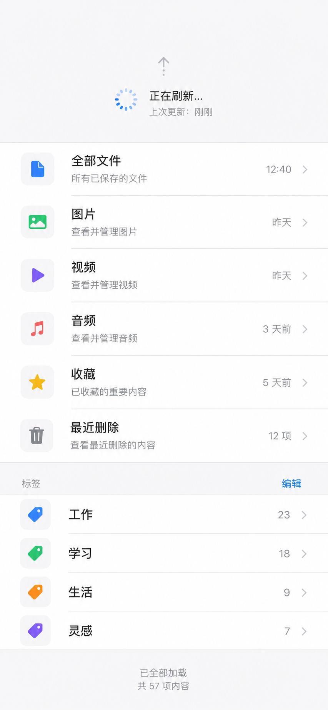
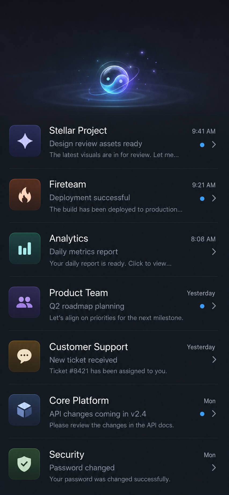
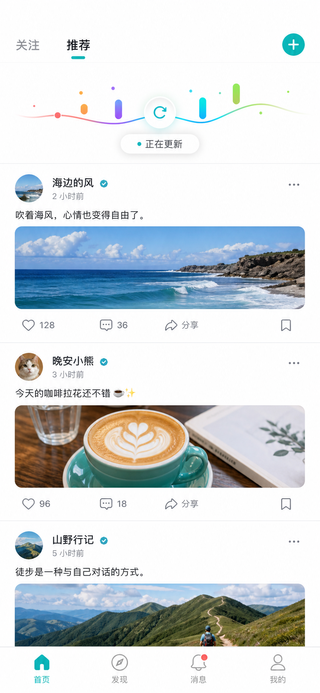

# Custom Refresh Styles Implementation Plan

> **For agentic workers:** REQUIRED SUB-SKILL: Use superpowers:subagent-driven-development (recommended) or superpowers:executing-plans to implement this plan task-by-task. Steps use checkbox (`- [ ]`) syntax for tracking.

**Goal:** Add three reusable UIKit refresh controls and a Demo page that lets users try each style in a real `UITableView`.

**Architecture:** Keep `RefreshableStyle` as the only integration contract. Add three public style classes backed by focused UIKit/Core Animation views, plus small public configuration structs where callers need text or theme control. The Demo adds one "样式" tab with a segmented picker that reinstalls the selected style on the same scroll view.

**Tech Stack:** Swift 6.0, UIKit, Core Animation, Swift Testing, iOS 13+, no third-party dependencies.

---

## Visual References

These three generated UI concepts are the visual targets for the implementation. The code should capture the refresh-control behavior, scale, state language, and material direction from each reference without trying to recreate unrelated list content pixel-for-pixel.

### 1. System Native Stack



Implementation target: compact native refresh UI with an arrow, progress ring, spinner, and Chinese status text. This should feel closest to Apple's default system surfaces and remain suitable as a practical default-style upgrade.

### 2. Cosmic Glass Taiji



Implementation target: compact dark-mode glass taiji object with localized glow, short orbit arcs, and particle feedback. The control should stay around the existing 80-100pt taiji spec rather than becoming a full-screen hero scene.

### 3. Kinetic Ribbon



Implementation target: playful kinetic refresh UI with an elastic progress path, rotating refresh glyph, colored ticks, and a compact status pill. It should feel lively enough for the demo while still being implementable with UIKit/Core Animation.

## File Structure

- Create `Sources/Refreshable/SystemNativeRefreshStyle.swift`: compact native style, 64pt extent, arrow/progress/spinner/text.
- Create `Sources/Refreshable/TaijiRefreshStyle.swift`: compact glass taiji style, 92pt extent, theme palette, render model, accessibility values.
- Create `Sources/Refreshable/KineticRefreshStyle.swift`: lively custom style, 82pt extent, elastic path/ticks/glyph/status label.
- Create `Tests/RefreshableTests/CustomRefreshStyleTests.swift`: state mapping and accessibility tests for all three styles.
- Create `Demo/Demo/CustomStylesDemoController.swift`: style gallery page with segmented control and realistic table data.
- Modify `Demo/Demo/DemoTabBarController.swift`: add the new "样式" tab.
- Modify `README.md`: document the three built-in custom styles and demo entry point.
- Add `docs/superpowers/plans/assets/custom-refresh-*.png`: generated visual references used by this plan.

## Public API Decisions

- `SystemNativeRefreshStyle` exposes `texts` and `configuration` similar to the existing default styles.
- `TaijiRefreshStyle` exposes `TaijiRefreshTheme`, `TaijiRefreshPalette`, and `setTheme(_:animated:)`.
- `KineticRefreshStyle` exposes `texts` and `palette`.
- All three styles conform directly to `RefreshableStyle`; no core refresh state or `UIScrollView` API changes are required.
- All visible UI remains under each style's `view`, and alpha visibility stays controlled by `RefreshComponent`.

---

### Task 1: Test The Public Shape

**Files:**
- Create: `Tests/RefreshableTests/CustomRefreshStyleTests.swift`

- [ ] **Step 1: Write failing tests**

Add tests that instantiate each style, verify `extent`, verify the root view is an accessibility element, and drive every `RefreshState` through `update(state:progress:)`.

```swift
import Testing
@testable import Refreshable
import UIKit

@Suite("Custom Refresh Styles", .tags(.ui))
@MainActor
struct CustomRefreshStyleTests {

    @Test("SystemNativeRefreshStyle exposes compact native state text")
    func systemNativeStateText() throws {
        let style = SystemNativeRefreshStyle()
        #expect(style.extent == 64)
        #expect(style.view.isAccessibilityElement)

        style.update(state: .idle, progress: 0)
        #expect(style.view.accessibilityValue == "未刷新")

        style.update(state: .triggered, progress: 1)
        #expect(style.view.accessibilityValue == "释放刷新")

        style.update(state: .refreshing, progress: 0)
        #expect(style.view.accessibilityValue == "正在刷新")
    }

    @Test("TaijiRefreshStyle maps refresh states without visible text")
    func taijiStateMapping() {
        let style = TaijiRefreshStyle()
        #expect(style.extent == 92)
        #expect(style.view.isAccessibilityElement)
        #expect(style.view.subviews.isEmpty == false)

        style.update(state: .pulling(0.5), progress: 0.5)
        #expect(style.view.accessibilityValue == "下拉中")

        style.update(state: .refreshing, progress: 0)
        #expect(style.view.accessibilityValue == "正在刷新")

        style.update(state: .ending, progress: 0)
        #expect(style.view.accessibilityValue == "刷新完成")
    }

    @Test("TaijiRefreshStyle supports runtime theme switching")
    func taijiThemeSwitching() {
        let style = TaijiRefreshStyle(theme: .dark)
        style.setTheme(.light, animated: false)
        #expect(style.theme == .light)
    }

    @Test("KineticRefreshStyle exposes playful state text")
    func kineticStateText() throws {
        let style = KineticRefreshStyle()
        #expect(style.extent == 82)
        #expect(style.view.isAccessibilityElement)

        style.update(state: .triggered, progress: 1)
        #expect(style.view.accessibilityValue == "释放刷新")

        style.update(state: .refreshing, progress: 0)
        #expect(style.view.accessibilityValue == "正在更新")
    }
}
```

- [ ] **Step 2: Run tests and verify failure**

Run:

```bash
xcodebuild test -scheme Refreshable -destination 'platform=iOS Simulator,name=iPhone 17 Pro' -skipPackagePluginValidation -only-testing:RefreshableTests/CustomRefreshStyleTests
```

Expected: build fails because `SystemNativeRefreshStyle`, `TaijiRefreshStyle`, and `KineticRefreshStyle` do not exist.

---

### Task 2: Implement SystemNativeRefreshStyle

**Files:**
- Create: `Sources/Refreshable/SystemNativeRefreshStyle.swift`
- Test: `Tests/RefreshableTests/CustomRefreshStyleTests.swift`

- [ ] **Step 1: Add native style implementation**

Create a public final class with:

- `public let view = UIView()`
- `public let extent: CGFloat = 64`
- a centered horizontal stack containing `UIImageView`, `UIActivityIndicatorView`, ring `CAShapeLayer`, and `UILabel`
- text defaults: `下拉刷新`, `继续下拉`, `释放刷新`, `正在刷新...`, `刷新完成`
- VoiceOver values matching existing Chinese defaults
- reduce-motion support by avoiding arrow rotation when enabled

- [ ] **Step 2: Verify focused tests**

Run:

```bash
xcodebuild test -scheme Refreshable -destination 'platform=iOS Simulator,name=iPhone 17 Pro' -skipPackagePluginValidation -only-testing:RefreshableTests/CustomRefreshStyleTests/systemNativeStateText
```

Expected: `systemNativeStateText` passes.

---

### Task 3: Implement TaijiRefreshStyle

**Files:**
- Create: `Sources/Refreshable/TaijiRefreshStyle.swift`
- Test: `Tests/RefreshableTests/CustomRefreshStyleTests.swift`

- [ ] **Step 1: Add theme types**

Add:

```swift
public enum TaijiRefreshTheme: Sendable, Equatable {
    case system
    case light
    case dark
    case custom(TaijiRefreshPalette)
}

public struct TaijiRefreshPalette: Sendable, Equatable {
    public var backgroundTint: UIColor
    public var primaryGlow: UIColor
    public var secondaryGlow: UIColor
    public var glassHighlight: UIColor
    public var shadowCore: UIColor
    public var particle: UIColor
}
```

Use `@unchecked Sendable` only if Swift requires it for `UIColor` storage.

- [ ] **Step 2: Add style and render view**

Create `TaijiRefreshStyle` with:

- `public let extent: CGFloat`
- `public private(set) var theme: TaijiRefreshTheme`
- `public init(extent: CGFloat = 92, theme: TaijiRefreshTheme = .system)`
- `public func setTheme(_ theme: TaijiRefreshTheme, animated: Bool = true)`
- `func update(state:progress:)` mapping state to scale, alpha, rotation, arc sweep, particle alpha, and accessibility value

- [ ] **Step 3: Verify focused tests**

Run:

```bash
xcodebuild test -scheme Refreshable -destination 'platform=iOS Simulator,name=iPhone 17 Pro' -skipPackagePluginValidation -only-testing:RefreshableTests/CustomRefreshStyleTests/taijiStateMapping -only-testing:RefreshableTests/CustomRefreshStyleTests/taijiThemeSwitching
```

Expected: both Taiji tests pass.

---

### Task 4: Implement KineticRefreshStyle

**Files:**
- Create: `Sources/Refreshable/KineticRefreshStyle.swift`
- Test: `Tests/RefreshableTests/CustomRefreshStyleTests.swift`

- [ ] **Step 1: Add playful style implementation**

Create a public final class with:

- `public let extent: CGFloat = 82`
- an elastic path layer, rotating refresh glyph, four small tick layers, and a compact rounded status label
- default texts: `下拉刷新`, `松手刷新`, `正在更新`, `刷新完成`
- palette defaults: teal, coral, indigo, lime, neutral ink
- reduce-motion support by replacing spin with opacity/scale updates

- [ ] **Step 2: Verify focused tests**

Run:

```bash
xcodebuild test -scheme Refreshable -destination 'platform=iOS Simulator,name=iPhone 17 Pro' -skipPackagePluginValidation -only-testing:RefreshableTests/CustomRefreshStyleTests/kineticStateText
```

Expected: `kineticStateText` passes.

---

### Task 5: Add Demo Style Gallery Page

**Files:**
- Create: `Demo/Demo/CustomStylesDemoController.swift`
- Modify: `Demo/Demo/DemoTabBarController.swift`

- [ ] **Step 1: Create demo controller**

Add a `UIViewController` containing:

- a `UISegmentedControl` with `系统`, `太极`, `动感`
- a `UITableView` with 24 realistic rows
- `installSelectedStyle()` that removes the current refreshable and installs the selected style
- a refresh action that sleeps briefly, prepends a row, reloads the table, and resets load-more state
- a load-more action using `KineticRefreshStyle` or `SystemNativeRefreshStyle` to show footer compatibility

- [ ] **Step 2: Add tab entry**

Insert a fifth tab in `DemoTabBarController.viewDidLoad()`:

```swift
makeNavigationController(
    rootViewController: CustomStylesDemoController(),
    title: "样式",
    imageName: "sparkles"
)
```

- [ ] **Step 3: Build demo**

Run:

```bash
xcodebuild build -project Demo/Demo.xcodeproj -scheme Demo -destination 'platform=iOS Simulator,name=iPhone 17 Pro' -skipPackagePluginValidation
```

Expected: demo app builds.

---

### Task 6: README And Full Verification

**Files:**
- Modify: `README.md`

- [ ] **Step 1: Document styles**

Add a short "内置自定义样式" section with usage snippets:

```swift
tableView.refreshable(style: SystemNativeRefreshStyle()) { await reload() }
tableView.refreshable(style: TaijiRefreshStyle()) { await reload() }
tableView.refreshable(style: KineticRefreshStyle()) { await reload() }
```

- [ ] **Step 2: Run package tests**

Run:

```bash
xcodebuild test -scheme Refreshable -destination 'platform=iOS Simulator,name=iPhone 17 Pro' -skipPackagePluginValidation
```

Expected: all package tests pass.

- [ ] **Step 3: Run demo build**

Run:

```bash
xcodebuild build -project Demo/Demo.xcodeproj -scheme Demo -destination 'platform=iOS Simulator,name=iPhone 17 Pro' -skipPackagePluginValidation
```

Expected: demo app builds.
