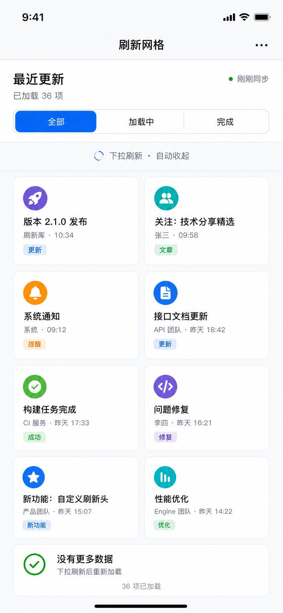

# Grid Refresh State Footer UI Implementation Plan

> **For agentic workers:** REQUIRED SUB-SKILL: Use superpowers:subagent-driven-development (recommended) or superpowers:executing-plans to implement this plan task-by-task. Steps use checkbox (`- [ ]`) syntax for tracking.

**Goal:** Upgrade the grid demo into a simple mobile-first Refreshable screen that shows pull-to-refresh, automatic bottom load-more, and a terminal full-width `没有更多数据` collection footer without numbered pagination.

**Architecture:** Keep the implementation scoped to the Demo app. `CollectionViewDemoController` owns the mock update data, filters, compositional grid layout, header, footer, cells, and Refreshable wiring; the package API remains unchanged. The screen uses `UICollectionView` with a fixed-height two-column layout, `SystemNativeRefreshStyle` for top refresh, and `DefaultBottomLoadMoreStyle` that ends normally, then is removed from the view hierarchy instead of entering `collectionView.noMoreData()`.

**Tech Stack:** Swift, UIKit, UICollectionViewCompositionalLayout, Refreshable, SF Symbols, XCTest UI tests, Xcode Demo app.

---

## Source Documents And Assets

- UI DSL: `docs/superpowers/specs/2026-07-06-grid-refresh-state-footer-ui-dsl.md`
- Selected target image: `docs/superpowers/specs/assets/grid-refresh-state-footer-selected.png`

## Visual Reference



## File Structure

- Modify: `Demo/Demo/CollectionViewDemoController.swift`
  - Replace placeholder numbered color cells with `GridUpdateItem` content.
  - Add `GridFilter`, `GridLoadState`, deterministic mock data factories, and page state.
  - Replace the 3-column square layout with a 2-column mobile card layout.
  - Add a collection header with title, loaded count, sync status, and segmented filters.
  - Keep grid cells in fixed-height two-column rows; long titles can wrap but must not create a masonry layout.
  - Refresh should reset the dataset, hide the no-more footer, and reinstall bottom loading without inserting a transient status card into the grid.
  - Render `没有更多数据` as a full-width `UICollectionView.elementKindSectionFooter`, not as a regular grid cell.
  - Install top refresh and bottom load-more with Refreshable options that match the selected UI.
  - Do not call `collectionView.noMoreData()` in this screen; after the final normal load ending, remove the bottom load-more component from the view hierarchy.
- Modify: `Demo/DemoUITests/DemoUITests.swift`
  - Add smoke coverage for the grid screen labels and the absence of numbered pagination UI.
  - Add behavior coverage for filtering and the terminal no-more-data footer copy and dimensions.
- Read only: `Sources/Refreshable/Core/RefreshableOptions.swift`
  - Confirms `automaticTriggerOffset`, `removeLoadMoreable()`, and bottom load-more behavior are already public.
- Read only: `Sources/Refreshable/Styles/Default/DefaultRefreshStyleConfiguration.swift`
  - Confirms bottom load-more copy can be customized through `DefaultBottomLoadMoreTexts`.
- Read only: `Sources/Refreshable/Styles/Custom/SystemNativeRefreshStyle.swift`
  - Confirms a compact native top refresh style exists for the selected UI direction.

## Task 1: Add UI Tests For The Selected Grid Direction

**Files:**
- Modify: `Demo/DemoUITests/DemoUITests.swift`
- Modify later: `Demo/Demo/CollectionViewDemoController.swift`

- [ ] **Step 1: Add a smoke test for the production grid screen**

Append this test inside `DemoUITests`:

```swift
@MainActor
func testGridRefreshStateFooterScreenLoads() throws {
    let app = XCUIApplication()
    app.launch()

    let gridTab = app.tabBars.buttons["网格"]
    XCTAssertTrue(gridTab.waitForExistence(timeout: 5))
    gridTab.tap()

    XCTAssertTrue(app.navigationBars["刷新网格"].waitForExistence(timeout: 3))
    XCTAssertTrue(app.staticTexts["最近更新"].waitForExistence(timeout: 3))
    XCTAssertTrue(app.staticTexts["已加载 36 项"].waitForExistence(timeout: 3))
    XCTAssertTrue(app.staticTexts["刚刚同步"].waitForExistence(timeout: 3))
    XCTAssertTrue(app.buttons["全部"].waitForExistence(timeout: 3))
    XCTAssertTrue(app.buttons["加载中"].waitForExistence(timeout: 3))
    XCTAssertTrue(app.buttons["完成"].waitForExistence(timeout: 3))
    XCTAssertFalse(app.staticTexts["下拉刷新 · 自动收起"].exists)
    XCTAssertTrue(app.staticTexts["版本 2.1.0 发布"].waitForExistence(timeout: 3))
    XCTAssertTrue(app.staticTexts["接口文档更新"].waitForExistence(timeout: 3))
}
```

- [ ] **Step 2: Add a test that rejects desktop pagination UI**

Append this test inside `DemoUITests`:

```swift
@MainActor
func testGridRefreshDoesNotShowNumberedPagination() throws {
    let app = XCUIApplication()
    app.launch()

    let gridTab = app.tabBars.buttons["网格"]
    XCTAssertTrue(gridTab.waitForExistence(timeout: 5))
    gridTab.tap()

    XCTAssertTrue(app.navigationBars["刷新网格"].waitForExistence(timeout: 3))
    XCTAssertFalse(app.buttons["1"].exists)
    XCTAssertFalse(app.buttons["2"].exists)
    XCTAssertFalse(app.buttons["3"].exists)
    XCTAssertFalse(app.staticTexts["..."].exists)
    XCTAssertFalse(app.staticTexts["…"].exists)
}
```

- [ ] **Step 3: Add a filter test for the three selected segments**

Append this test inside `DemoUITests`:

```swift
@MainActor
func testGridRefreshFiltersItems() throws {
    let app = XCUIApplication()
    app.launch()

    let gridTab = app.tabBars.buttons["网格"]
    XCTAssertTrue(gridTab.waitForExistence(timeout: 5))
    gridTab.tap()

    XCTAssertTrue(app.staticTexts["版本 2.1.0 发布"].waitForExistence(timeout: 3))

    app.buttons["加载中"].tap()
    XCTAssertTrue(app.staticTexts["接口文档更新"].waitForExistence(timeout: 3))
    XCTAssertTrue(app.staticTexts["性能优化"].waitForExistence(timeout: 3))
    XCTAssertFalse(app.staticTexts["构建任务完成"].exists)

    app.buttons["完成"].tap()
    XCTAssertTrue(app.staticTexts["构建任务完成"].waitForExistence(timeout: 3))
    XCTAssertTrue(app.staticTexts["问题修复"].waitForExistence(timeout: 3))
    XCTAssertFalse(app.staticTexts["接口文档更新"].exists)

    app.buttons["全部"].tap()
    XCTAssertTrue(app.staticTexts["版本 2.1.0 发布"].waitForExistence(timeout: 3))
    XCTAssertTrue(app.staticTexts["系统通知"].waitForExistence(timeout: 3))
}
```

- [ ] **Step 4: Run the new UI tests and confirm they fail before implementation**

Run:

```bash
xcodebuild test -project Demo/Demo.xcodeproj -scheme Demo -destination 'platform=iOS Simulator,name=iPhone 17' -only-testing:DemoUITests/DemoUITests/testGridRefreshStateFooterScreenLoads -only-testing:DemoUITests/DemoUITests/testGridRefreshDoesNotShowNumberedPagination -only-testing:DemoUITests/DemoUITests/testGridRefreshFiltersItems
```

Expected before implementation: `testGridRefreshStateFooterScreenLoads` fails because the navigation title is still `网格分页`, the placeholder cells are numeric, and the selected header/cell labels do not exist.

## Task 2: Replace Placeholder Grid Data With Refreshable Update Models

**Files:**
- Modify: `Demo/Demo/CollectionViewDemoController.swift`

- [ ] **Step 1: Add the grid model and filter types**

Insert these types below the imports:

```swift
fileprivate struct GridUpdateItem {
    enum ChipStyle {
        case update
        case article
        case reminder
        case success
        case repair
        case feature
        case optimize
    }

    enum Status {
        case all
        case loading
        case complete
    }

    let title: String
    let source: String
    let time: String
    let chip: String
    let chipStyle: ChipStyle
    let symbolName: String
    let tintColor: UIColor
    let status: Status
}

fileprivate enum GridFilter: Int {
    case all
    case loading
    case complete

    var selectedIndex: Int { rawValue }

    func includes(_ item: GridUpdateItem) -> Bool {
        switch self {
        case .all:
            return true
        case .loading:
            return item.status == .loading
        case .complete:
            return item.status == .complete
        }
    }
}
```

- [ ] **Step 2: Replace the controller state**

Replace these properties:

```swift
private var collectionView: UICollectionView!
private var items: [Int] = []
private var page = 0

private let colors: [UIColor] = [
    .systemRed, .systemBlue, .systemGreen, .systemOrange,
    .systemPurple, .systemTeal, .systemPink, .systemIndigo,
]
```

with:

```swift
private var collectionView: UICollectionView!
private var allItems: [GridUpdateItem] = []
private var items: [GridUpdateItem] = []
private var page = 0
private var selectedFilter: GridFilter = .all
private let totalCount = 36
```

- [ ] **Step 3: Add deterministic item factories**

Add these methods before `loadInitialData()`:

```swift
private func makeInitialItems() -> [GridUpdateItem] {
    [
        GridUpdateItem(
            title: "版本 2.1.0 发布",
            source: "刷新库",
            time: "10:34",
            chip: "更新",
            chipStyle: .update,
            symbolName: "paperplane.fill",
            tintColor: .systemPurple,
            status: .all
        ),
        GridUpdateItem(
            title: "关注：技术分享精选",
            source: "张三",
            time: "09:58",
            chip: "文章",
            chipStyle: .article,
            symbolName: "person.2.fill",
            tintColor: .systemTeal,
            status: .all
        ),
        GridUpdateItem(
            title: "系统通知",
            source: "系统",
            time: "09:12",
            chip: "提醒",
            chipStyle: .reminder,
            symbolName: "bell.fill",
            tintColor: .systemOrange,
            status: .all
        ),
        GridUpdateItem(
            title: "接口文档更新",
            source: "API 团队",
            time: "昨天 18:42",
            chip: "更新",
            chipStyle: .update,
            symbolName: "doc.text.fill",
            tintColor: .systemBlue,
            status: .loading
        ),
        GridUpdateItem(
            title: "构建任务完成",
            source: "CI 服务",
            time: "昨天 17:33",
            chip: "成功",
            chipStyle: .success,
            symbolName: "checkmark.circle.fill",
            tintColor: .systemGreen,
            status: .complete
        ),
        GridUpdateItem(
            title: "问题修复",
            source: "李四",
            time: "昨天 16:21",
            chip: "修复",
            chipStyle: .repair,
            symbolName: "chevron.left.forwardslash.chevron.right",
            tintColor: .systemPurple,
            status: .complete
        ),
        GridUpdateItem(
            title: "新功能：自定义刷新头",
            source: "产品团队",
            time: "昨天 15:07",
            chip: "新功能",
            chipStyle: .feature,
            symbolName: "star.fill",
            tintColor: .systemBlue,
            status: .all
        ),
        GridUpdateItem(
            title: "性能优化",
            source: "Engine 团队",
            time: "昨天 14:22",
            chip: "优化",
            chipStyle: .optimize,
            symbolName: "chart.bar.fill",
            tintColor: .systemTeal,
            status: .loading
        ),
    ]
}

private func makePageItems(page: Int) -> [GridUpdateItem] {
    let base = (page - 1) * 4
    var pageItems = [
        GridUpdateItem(
            title: "自动加载批次 \(base + 1)",
            source: "loadMoreable",
            time: "第 \(page) 页",
            chip: "加载",
            chipStyle: .update,
            symbolName: "arrow.down.circle.fill",
            tintColor: .systemBlue,
            status: .loading
        ),
        GridUpdateItem(
            title: "边缘触发记录 \(base + 2)",
            source: "automaticTriggerOffset",
            time: "120pt",
            chip: "触发",
            chipStyle: .article,
            symbolName: "scope",
            tintColor: .systemTeal,
            status: .loading
        ),
        GridUpdateItem(
            title: "分页合并完成 \(base + 3)",
            source: "UICollectionView",
            time: "刚刚",
            chip: "完成",
            chipStyle: .success,
            symbolName: "square.grid.2x2.fill",
            tintColor: .systemGreen,
            status: .complete
        ),
    ]

    let terminalItem: GridUpdateItem
    if page == 3 {
        terminalItem = GridUpdateItem(
            title: "没有更多数据",
            source: "下拉刷新后重新加载",
            time: "\(totalCount) 项已加载",
            chip: "完成",
            chipStyle: .success,
            symbolName: "checkmark.circle.fill",
            tintColor: .systemGreen,
            status: .complete
        )
    } else {
        terminalItem = GridUpdateItem(
            title: "结束状态确认 \(base + 4)",
            source: "noMoreData",
            time: "刚刚",
            chip: "完成",
            chipStyle: .success,
            symbolName: "checkmark.seal.fill",
            tintColor: .systemGreen,
            status: .complete
        )
    }

    pageItems.append(terminalItem)
    return pageItems
}
```

- [ ] **Step 4: Run a focused compile check**

Run:

```bash
xcodebuild build -project Demo/Demo.xcodeproj -scheme Demo -destination 'platform=iOS Simulator,name=iPhone 17'
```

Expected after only Step 1-3: build fails because `cellForItemAt` still expects `Int` and `ColorCell`.

## Task 3: Build The Simple Mobile Header And Two-Column Grid

**Files:**
- Modify: `Demo/Demo/CollectionViewDemoController.swift`

- [ ] **Step 1: Update `viewDidLoad` title and collection registration**

Replace `title = "网格分页"` with:

```swift
title = "刷新网格"
navigationItem.rightBarButtonItem = UIBarButtonItem(
    image: UIImage(systemName: "ellipsis"),
    style: .plain,
    target: nil,
    action: nil
)
```

Replace the existing registration line:

```swift
collectionView.register(ColorCell.self, forCellWithReuseIdentifier: "ColorCell")
```

with:

```swift
collectionView.register(GridUpdateCell.self, forCellWithReuseIdentifier: GridUpdateCell.reuseIdentifier)
collectionView.register(
    GridHeaderView.self,
    forSupplementaryViewOfKind: UICollectionView.elementKindSectionHeader,
    withReuseIdentifier: GridHeaderView.reuseIdentifier
)
collectionView.delegate = self
```

- [ ] **Step 2: Replace the layout with a two-column compositional layout**

Replace `makeLayout()` with:

```swift
private func makeLayout() -> UICollectionViewCompositionalLayout {
    let layout = UICollectionViewCompositionalLayout { [weak self] _, _ in
        self?.makeGridSection()
    }
    let configuration = UICollectionViewCompositionalLayoutConfiguration()
    configuration.scrollDirection = .vertical
    layout.configuration = configuration
    return layout
}

private func makeGridSection() -> NSCollectionLayoutSection {
    let itemSize = NSCollectionLayoutSize(
        widthDimension: .fractionalWidth(0.5),
        heightDimension: .absolute(150)
    )
    let item = NSCollectionLayoutItem(layoutSize: itemSize)
    item.contentInsets = NSDirectionalEdgeInsets(top: 5, leading: 5, bottom: 5, trailing: 5)

    let groupSize = NSCollectionLayoutSize(
        widthDimension: .fractionalWidth(1.0),
        heightDimension: .absolute(150)
    )
    let group = NSCollectionLayoutGroup.horizontal(layoutSize: groupSize, subitem: item, count: 2)

    let section = NSCollectionLayoutSection(group: group)
    section.contentInsets = NSDirectionalEdgeInsets(top: 8, leading: 18, bottom: 10, trailing: 18)

    let headerSize = NSCollectionLayoutSize(
        widthDimension: .fractionalWidth(1.0),
        heightDimension: .estimated(214)
    )
    let header = NSCollectionLayoutBoundarySupplementaryItem(
        layoutSize: headerSize,
        elementKind: UICollectionView.elementKindSectionHeader,
        alignment: .top
    )

    var boundarySupplementaryItems = [header]
    if hasLoadedAllPages {
        let footerSize = NSCollectionLayoutSize(
            widthDimension: .fractionalWidth(1.0),
            heightDimension: .absolute(124)
        )
        let footer = NSCollectionLayoutBoundarySupplementaryItem(
            layoutSize: footerSize,
            elementKind: UICollectionView.elementKindSectionFooter,
            alignment: .bottom
        )
        boundarySupplementaryItems.append(footer)
    }

    section.boundarySupplementaryItems = boundarySupplementaryItems
    return section
}
```

- [ ] **Step 3: Add collection view supplementary data source**

Add this method to `CollectionViewDemoController`:

```swift
func collectionView(
    _ collectionView: UICollectionView,
    viewForSupplementaryElementOfKind kind: String,
    at indexPath: IndexPath
) -> UICollectionReusableView {
    switch kind {
    case UICollectionView.elementKindSectionHeader:
        let header = collectionView.dequeueReusableSupplementaryView(
            ofKind: kind,
            withReuseIdentifier: GridHeaderView.reuseIdentifier,
            for: indexPath
        ) as! GridHeaderView
        header.configure(
            loadedText: "已加载 \(allItems.count) 项",
            selectedIndex: selectedFilter.selectedIndex
        )
        header.onSelectedIndexChange = { [weak self] selectedIndex in
            self?.selectFilter(at: selectedIndex)
        }
        return header

    default:
        return UICollectionReusableView()
    }
}
```

- [ ] **Step 4: Run the new smoke test and confirm the next failure**

Run:

```bash
xcodebuild test -project Demo/Demo.xcodeproj -scheme Demo -destination 'platform=iOS Simulator,name=iPhone 17' -only-testing:DemoUITests/DemoUITests/testGridRefreshStateFooterScreenLoads
```

Expected: the build still fails until `GridHeaderView` and `GridUpdateCell` are added.

## Task 4: Implement Header, Cell, And Chip Views

**Files:**
- Modify: `Demo/Demo/CollectionViewDemoController.swift`

- [ ] **Step 1: Replace `ColorCell` with `GridUpdateCell`**

Delete `ColorCell` and add:

```swift
private final class GridUpdateCell: UICollectionViewCell {
    static let reuseIdentifier = "GridUpdateCell"

    private let iconContainer = UIView()
    private let iconView = UIImageView()
    private let titleLabel = UILabel()
    private let metaLabel = UILabel()
    private let chipView = StatusChipView()

    override init(frame: CGRect) {
        super.init(frame: frame)
        setupUI()
    }

    required init?(coder: NSCoder) { fatalError() }

    func configure(with item: GridUpdateItem) {
        iconContainer.backgroundColor = item.tintColor.withAlphaComponent(0.16)
        iconView.image = UIImage(systemName: item.symbolName)
        iconView.tintColor = item.tintColor
        titleLabel.text = item.title
        metaLabel.text = "\(item.source) · \(item.time)"
        chipView.configure(text: item.chip, style: item.chipStyle)
        accessibilityLabel = "\(item.title)，\(item.source)，\(item.time)，\(item.chip)"
    }

    private func setupUI() {
        contentView.backgroundColor = .secondarySystemGroupedBackground
        contentView.layer.cornerRadius = 8
        contentView.layer.borderWidth = 1 / UIScreen.main.scale
        contentView.layer.borderColor = UIColor.separator.withAlphaComponent(0.45).cgColor
        contentView.clipsToBounds = true
        isAccessibilityElement = false
        contentView.isAccessibilityElement = false

        iconContainer.translatesAutoresizingMaskIntoConstraints = false
        iconContainer.layer.cornerRadius = 28
        contentView.addSubview(iconContainer)

        iconView.contentMode = .scaleAspectFit
        iconView.preferredSymbolConfiguration = UIImage.SymbolConfiguration(pointSize: 26, weight: .semibold)
        iconView.translatesAutoresizingMaskIntoConstraints = false
        iconContainer.addSubview(iconView)

        titleLabel.font = .systemFont(ofSize: 19, weight: .bold)
        titleLabel.textColor = .label
        titleLabel.numberOfLines = 2
        titleLabel.adjustsFontForContentSizeCategory = true
        titleLabel.translatesAutoresizingMaskIntoConstraints = false
        contentView.addSubview(titleLabel)

        metaLabel.font = .systemFont(ofSize: 15)
        metaLabel.textColor = .secondaryLabel
        metaLabel.numberOfLines = 1
        metaLabel.adjustsFontForContentSizeCategory = true
        metaLabel.translatesAutoresizingMaskIntoConstraints = false
        contentView.addSubview(metaLabel)

        chipView.translatesAutoresizingMaskIntoConstraints = false
        contentView.addSubview(chipView)

        NSLayoutConstraint.activate([
            iconContainer.topAnchor.constraint(equalTo: contentView.topAnchor, constant: 14),
            iconContainer.leadingAnchor.constraint(equalTo: contentView.leadingAnchor, constant: 14),
            iconContainer.widthAnchor.constraint(equalToConstant: 56),
            iconContainer.heightAnchor.constraint(equalTo: iconContainer.widthAnchor),

            iconView.centerXAnchor.constraint(equalTo: iconContainer.centerXAnchor),
            iconView.centerYAnchor.constraint(equalTo: iconContainer.centerYAnchor),

            titleLabel.topAnchor.constraint(equalTo: iconContainer.bottomAnchor, constant: 12),
            titleLabel.leadingAnchor.constraint(equalTo: contentView.leadingAnchor, constant: 14),
            titleLabel.trailingAnchor.constraint(equalTo: contentView.trailingAnchor, constant: -14),

            metaLabel.topAnchor.constraint(equalTo: titleLabel.bottomAnchor, constant: 6),
            metaLabel.leadingAnchor.constraint(equalTo: titleLabel.leadingAnchor),
            metaLabel.trailingAnchor.constraint(equalTo: titleLabel.trailingAnchor),

            chipView.topAnchor.constraint(equalTo: metaLabel.bottomAnchor, constant: 10),
            chipView.leadingAnchor.constraint(equalTo: titleLabel.leadingAnchor),
            chipView.bottomAnchor.constraint(lessThanOrEqualTo: contentView.bottomAnchor, constant: -14),
        ])
    }
}
```

- [ ] **Step 2: Add `StatusChipView`**

Add:

```swift
private final class StatusChipView: UILabel {
    override init(frame: CGRect) {
        super.init(frame: frame)
        font = .systemFont(ofSize: 13, weight: .semibold)
        textAlignment = .center
        layer.cornerRadius = 6
        clipsToBounds = true
        adjustsFontForContentSizeCategory = true
    }

    required init?(coder: NSCoder) { fatalError() }

    override var intrinsicContentSize: CGSize {
        let size = super.intrinsicContentSize
        return CGSize(width: size.width + 20, height: size.height + 8)
    }

    func configure(text: String, style: GridUpdateItem.ChipStyle) {
        self.text = text
        let colors = style.colors
        textColor = colors.foreground
        backgroundColor = colors.background
    }
}

private extension GridUpdateItem.ChipStyle {
    var colors: (foreground: UIColor, background: UIColor) {
        switch self {
        case .update, .feature:
            return (.systemBlue, UIColor.systemBlue.withAlphaComponent(0.12))
        case .article:
            return (.systemTeal, UIColor.systemTeal.withAlphaComponent(0.12))
        case .reminder:
            return (.systemOrange, UIColor.systemOrange.withAlphaComponent(0.12))
        case .success, .optimize:
            return (.systemGreen, UIColor.systemGreen.withAlphaComponent(0.12))
        case .repair:
            return (.systemPurple, UIColor.systemPurple.withAlphaComponent(0.12))
        }
    }
}
```

- [ ] **Step 3: Add `GridHeaderView`**

Add:

```swift
private final class GridHeaderView: UICollectionReusableView {
    static let reuseIdentifier = "GridHeaderView"

    var onSelectedIndexChange: ((Int) -> Void)?

    private let titleLabel = UILabel()
    private let loadedLabel = UILabel()
    private let syncDot = UIView()
    private let syncLabel = UILabel()
    private let segmentedControl = UISegmentedControl(items: ["全部", "加载中", "完成"])

    override init(frame: CGRect) {
        super.init(frame: frame)
        setupUI()
    }

    required init?(coder: NSCoder) { fatalError() }

    func configure(loadedText: String, selectedIndex: Int) {
        loadedLabel.text = loadedText
        segmentedControl.selectedSegmentIndex = selectedIndex
    }

    private func setupUI() {
        backgroundColor = .systemGroupedBackground

        titleLabel.text = "最近更新"
        titleLabel.font = .systemFont(ofSize: 28, weight: .bold)
        titleLabel.adjustsFontForContentSizeCategory = true
        titleLabel.translatesAutoresizingMaskIntoConstraints = false
        addSubview(titleLabel)

        loadedLabel.font = .systemFont(ofSize: 17)
        loadedLabel.textColor = .secondaryLabel
        loadedLabel.adjustsFontForContentSizeCategory = true
        loadedLabel.translatesAutoresizingMaskIntoConstraints = false
        addSubview(loadedLabel)

        syncDot.backgroundColor = .systemGreen
        syncDot.layer.cornerRadius = 4
        syncDot.translatesAutoresizingMaskIntoConstraints = false
        addSubview(syncDot)

        syncLabel.text = "刚刚同步"
        syncLabel.font = .systemFont(ofSize: 16)
        syncLabel.textColor = .secondaryLabel
        syncLabel.translatesAutoresizingMaskIntoConstraints = false
        addSubview(syncLabel)

        segmentedControl.selectedSegmentIndex = 0
        segmentedControl.selectedSegmentTintColor = .systemBlue
        segmentedControl.addTarget(self, action: #selector(segmentChanged), for: .valueChanged)
        segmentedControl.translatesAutoresizingMaskIntoConstraints = false
        addSubview(segmentedControl)

        NSLayoutConstraint.activate([
            titleLabel.topAnchor.constraint(equalTo: topAnchor, constant: 28),
            titleLabel.leadingAnchor.constraint(equalTo: leadingAnchor, constant: 18),

            loadedLabel.topAnchor.constraint(equalTo: titleLabel.bottomAnchor, constant: 6),
            loadedLabel.leadingAnchor.constraint(equalTo: titleLabel.leadingAnchor),

            syncLabel.centerYAnchor.constraint(equalTo: titleLabel.centerYAnchor),
            syncLabel.trailingAnchor.constraint(equalTo: trailingAnchor, constant: -18),
            syncDot.centerYAnchor.constraint(equalTo: syncLabel.centerYAnchor),
            syncDot.trailingAnchor.constraint(equalTo: syncLabel.leadingAnchor, constant: -8),
            syncDot.widthAnchor.constraint(equalToConstant: 8),
            syncDot.heightAnchor.constraint(equalToConstant: 8),

            segmentedControl.topAnchor.constraint(equalTo: loadedLabel.bottomAnchor, constant: 24),
            segmentedControl.leadingAnchor.constraint(equalTo: leadingAnchor, constant: 18),
            segmentedControl.trailingAnchor.constraint(equalTo: trailingAnchor, constant: -18),
            segmentedControl.heightAnchor.constraint(equalToConstant: 38),
            segmentedControl.bottomAnchor.constraint(equalTo: bottomAnchor, constant: -18),
        ])
    }

    @objc private func segmentChanged() {
        onSelectedIndexChange?(segmentedControl.selectedSegmentIndex)
    }
}
```

- [ ] **Step 4: Confirm terminal no-more-data uses a section footer**

Add a reusable `GridNoMoreDataFooterView` registered for `UICollectionView.elementKindSectionFooter`. The final no-more-data UI is not returned from `makePageItems(page:)` and is not rendered by `GridUpdateCell`. It appears as a full-width rounded footer card with a green check icon, title `没有更多数据`, subtitle `下拉刷新后重新加载`, and centered count `36 项已加载`. The footer layout uses enough vertical space for the card content, and the count line must sit below the subtitle instead of overlapping it.

## Task 5: Wire Data, Filtering, Refresh, And Load-More Behavior

**Files:**
- Modify: `Demo/Demo/CollectionViewDemoController.swift`

- [ ] **Step 1: Update initial load and filtering**

Replace `loadInitialData()` with:

```swift
private func loadInitialData() {
    allItems = makeInitialItems()
    applyCurrentFilter(animated: false)
}

private func selectFilter(at selectedIndex: Int) {
    guard let filter = GridFilter(rawValue: selectedIndex),
          filter != selectedFilter else { return }
    selectedFilter = filter
    applyCurrentFilter(animated: true)
}

private func applyCurrentFilter(animated: Bool) {
    items = allItems.filter { selectedFilter.includes($0) }
    let updates = {
        self.collectionView.reloadData()
    }

    if animated {
        UIView.transition(
            with: collectionView,
            duration: 0.18,
            options: [.transitionCrossDissolve, .allowUserInteraction],
            animations: updates
        )
    } else {
        updates()
    }
}
```

- [ ] **Step 2: Update the data source methods**

Replace `cellForItemAt` with:

```swift
func collectionView(_ collectionView: UICollectionView, cellForItemAt indexPath: IndexPath) -> UICollectionViewCell {
    let cell = collectionView.dequeueReusableCell(
        withReuseIdentifier: GridUpdateCell.reuseIdentifier,
        for: indexPath
    ) as! GridUpdateCell
    cell.configure(with: items[indexPath.item])
    return cell
}
```

- [ ] **Step 3: Update refresh and load-more wiring**

Replace the existing `collectionView.refreshable` and `collectionView.loadMoreable` calls with:

```swift
collectionView.refreshable(
    style: SystemNativeRefreshStyle(
        extent: 52,
        lastUpdatedText: "刷新后重置加载状态"
    ),
    options: RefreshableOptions(
        triggerOffset: 72,
        animationDuration: 0.3,
        placement: RefreshablePlacement(contentSpacing: 0),
        presentation: .overlay(spacing: 12, locksContentOffset: true),
        overlayAnchor: .viewport
    )
) { [weak self] in
    try? await Task.sleep(nanoseconds: 900_000_000)
    await self?.performRefresh()
}

collectionView.loadMoreable(
    style: DefaultBottomLoadMoreStyle(
        texts: DefaultBottomLoadMoreTexts(
            idle: "继续向上滑动",
            pulling: "继续向上滑动",
            triggered: "释放加载",
            refreshing: "正在加载...",
            ending: "加载完成",
            noMoreData: "",
            noMoreDataAccessibilityValue: ""
        )
    ),
    options: RefreshableOptions(
        animationDuration: 0.28,
        automaticTriggerOffset: 120,
        placement: RefreshablePlacement(contentSpacing: 0),
        presentation: .overlay(spacing: 0),
        overlayAnchor: .contentBoundary
    )
) { [weak self] in
    try? await Task.sleep(nanoseconds: 700_000_000)
    await self?.appendNextPage()
}
```

- [ ] **Step 4: Add refresh and pagination methods**

Add:

```swift
@MainActor
private func performRefresh() {
    page = 0
    hasLoadedAllPages = false
    installBottomLoadMore()
    allItems = makeInitialItems()
    applyCurrentFilter(animated: false)
    collectionView.collectionViewLayout.invalidateLayout()
}

@MainActor
private func appendNextPage() {
    guard !hasLoadedAllPages else { return }
    page += 1
    guard page <= 3 else {
        showNoMoreDataFooter()
        return
    }
    allItems.append(contentsOf: makePageItems(page: page))
    applyCurrentFilter(animated: false)
    if page == 3 {
        showNoMoreDataFooter()
    }
}

@MainActor
private func showNoMoreDataFooter() {
    guard !hasLoadedAllPages else { return }
    hasLoadedAllPages = true
    collectionView.collectionViewLayout.invalidateLayout()

    DispatchQueue.main.asyncAfter(deadline: .now() + 0.35) { [weak self] in
        guard let self, self.hasLoadedAllPages else { return }
        self.collectionView.removeLoadMoreable()
    }
}
```

- [ ] **Step 5: Run the grid UI tests**

Run:

```bash
xcodebuild test -project Demo/Demo.xcodeproj -scheme Demo -destination 'platform=iOS Simulator,name=iPhone 17' -only-testing:DemoUITests/DemoUITests/testGridRefreshStateFooterScreenLoads -only-testing:DemoUITests/DemoUITests/testGridRefreshDoesNotShowNumberedPagination -only-testing:DemoUITests/DemoUITests/testGridRefreshFiltersItems
```

Expected: all three selected grid tests pass.

## Task 6: Verify The Demo App And Document The Outcome

**Files:**
- Modify: `Demo/Demo/CollectionViewDemoController.swift`
- Modify: `Demo/DemoUITests/DemoUITests.swift`

- [ ] **Step 1: Run existing list refresh tests to catch regressions**

Run:

```bash
xcodebuild test -project Demo/Demo.xcodeproj -scheme Demo -destination 'platform=iOS Simulator,name=iPhone 17' -only-testing:DemoUITests/DemoUITests/testListRefreshProductionScreenLoads -only-testing:DemoUITests/DemoUITests/testListRefreshInsertsFreshRow -only-testing:DemoUITests/DemoUITests/testListRefreshSegmentSwitchFiltersRows
```

Expected: existing list refresh tests pass.

- [ ] **Step 2: Run the full Demo UI test target**

Run:

```bash
xcodebuild test -project Demo/Demo.xcodeproj -scheme Demo -destination 'platform=iOS Simulator,name=iPhone 17' -only-testing:DemoUITests
```

Expected: `DemoUITests` passes.

- [ ] **Step 3: Inspect the diff for rejected pagination**

Run:

```bash
rg "1 2 3|\\.\\.\\.|…|pagination|页码|上一页|下一页" Demo/Demo/CollectionViewDemoController.swift Demo/DemoUITests/DemoUITests.swift
```

Expected: no manual numbered pagination UI is introduced. Mentions inside test names or comments are acceptable only when they reject the desktop pagination pattern.

- [ ] **Step 4: Commit the implementation**

Run:

```bash
git add Demo/Demo/CollectionViewDemoController.swift Demo/DemoUITests/DemoUITests.swift docs/superpowers/specs/2026-07-06-grid-refresh-state-footer-ui-dsl.md docs/superpowers/plans/2026-07-06-grid-refresh-state-footer-ui.md docs/superpowers/specs/assets/grid-refresh-state-footer-selected.png
git commit -m "feat: add production grid refresh demo plan"
```

Expected: commit succeeds with the implementation, tests, UI DSL, plan, and selected visual asset.

## Self-Review

- Spec coverage: The plan covers the selected visual, two-column grid, simple mobile header, segmented filters, top Refreshable refresh, bottom automatic load-more, `noMoreData`, `resetNoMoreData`, and the explicit rejection of numbered pagination controls.
- Placeholder scan: The plan contains no unfinished marker terms, no deferred implementation notes, and no incomplete test steps.
- Type consistency: `GridUpdateItem`, `GridFilter`, `GridUpdateCell`, `GridHeaderView`, and `StatusChipView` names are consistent across tasks.
