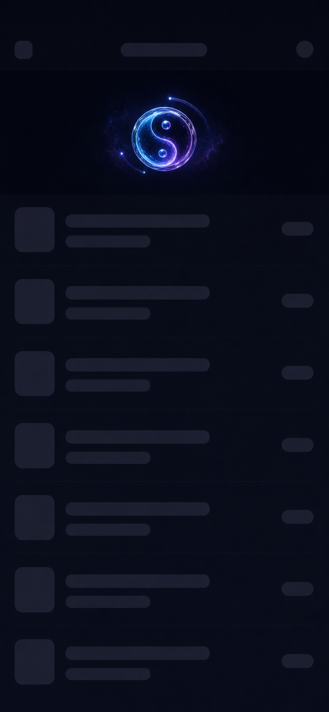

# Taiji Refresh Control Design

Date: 2026-06-28
Status: Design approved for specification; implementation not started

## Goal

Design a reusable UIKit refresh style for `Refreshable` that renders a compact, theme-aware taiji refresh control. The control should feel like a premium 3D translucent glass object in a restrained cosmic atmosphere, while still fitting a real `UIScrollView` refresh header.

The selected visual direction is **80-100pt compact cosmic glass**:

- Header height: 80-100pt.
- Taiji visual diameter: 44-56pt.
- No status text in the refresh control.
- State is communicated through progress arcs, rotation, glow intensity, particle density, and ripple fade.
- Purple/cyan cosmic atmosphere is localized around the taiji instead of becoming a poster-like hero scene.

Reference image:



## Product Fit

This design should ship as a style that follows the package's existing `RefreshableStyle` model. It should not require changes to the core `UIScrollView.refreshable(...)` installation API in its first implementation.

Recommended future public type:

```swift
@MainActor
public final class TaijiRefreshStyle: RefreshableStyle {
    public let view: UIView
    public let extent: CGFloat
    public private(set) var theme: TaijiRefreshTheme

    public init(
        extent: CGFloat = 92,
        theme: TaijiRefreshTheme = .system
    )

    public func setTheme(_ theme: TaijiRefreshTheme, animated: Bool = true)
    public func update(state: RefreshState, progress: CGFloat)
}
```

The style should work with:

- `scrollView.refreshable(style: TaijiRefreshStyle()) { ... }`
- `scrollView.refreshable(style: TaijiRefreshStyle(), options: RefreshableOptions(...)) { ... }`
- `RefreshableOptions.presentation == .contentInset`
- `RefreshableOptions.presentation == .overlay(...)`

## Visual Anatomy

The control is composed of five visual layers, from back to front:

1. **Localized cosmic mist**
   - A soft purple/indigo volumetric haze around the taiji.
   - It stays within the header bounds and fades before list content begins.
   - It must not become a full-width hero image or large nebula panel.

2. **Short 3D orbit arcs**
   - One or two partial, tilted glass arcs near the taiji.
   - Arcs imply depth with perspective, front/back occlusion, and alpha variation.
   - Avoid perfect flat concentric rings, dotted 2D circles, and ceremonial outer rings.

3. **3D glass taiji body**
   - A semi-transparent taiji with visible rim thickness.
   - Cyan and violet internal glow, subtle refraction, and glossy edge highlights.
   - The body remains readable at 44-56pt.

4. **Particle field**
   - Small star-like particles orbiting close to the body.
   - Density and velocity respond to pull progress and refresh state.
   - Particles are decorative state feedback, not data points.

5. **Completion ripple**
   - A short-lived transparent lens ripple when ending.
   - It expands outward and fades quickly without pushing list content.

## Theme Model

The style supports theme switching without requiring consumers to rebuild the scroll view.

Recommended future public API:

```swift
public enum TaijiRefreshTheme: Sendable, Equatable {
    case system
    case light
    case dark
    case custom(TaijiRefreshPalette)
}

public struct TaijiRefreshPalette: Sendable, Equatable {
    public var backgroundTint: UIColor
    public var primaryGlow: UIColor
    public var secondaryGlow: UIColor
    public var glassHighlight: UIColor
    public var shadowCore: UIColor
    public var particle: UIColor
}
```

Default palettes:

- **Dark:** graphite background, indigo mist, violet secondary glow, cyan primary glow, cool white highlights.
- **Light:** clear/near-white background, pale lavender mist, cyan primary glow, soft indigo shadow core. Light mode should look airy, not washed out.
- **System:** resolves to light or dark from `traitCollection.userInterfaceStyle`.
- **Custom:** lets users tune the palette while preserving the same animation rules.

Theme changes should animate over 180-250ms:

- Crossfade palette colors.
- Keep current rotation and progress continuity.
- Do not restart the refresh animation.

## State And Progress Mapping

The existing `RefreshableStyle.update(state:progress:)` callback is enough for the first implementation. The style should derive all visual state from `RefreshState` plus the normalized `progress` value.

### Idle

Purpose: invisible or nearly invisible.

- Taiji scale: 0.86.
- Alpha: 0.
- Mist alpha: 0.
- Arc alpha: 0.
- Particle count: 0.
- Rotation: preserve last settled angle to avoid jump on next pull.

### Pulling

Purpose: charge the object as the user drags.

Input: `RefreshState.pulling(p)` and `progress`, clamped to `0...1`.

- Taiji alpha: interpolate from 0.15 to 1.
- Taiji scale: interpolate from 0.86 to 1.
- Rotation: `p * 140` degrees, eased out.
- Inner glow: interpolate from 20% to 75%.
- Mist alpha: interpolate from 0 to 55%.
- Arc sweep: interpolate from 15 degrees to 260 degrees.
- Arc tilt: fixed perspective tilt around 62 degrees; never render as a flat circle.
- Particle count: interpolate from 2 to 18.
- Particle radius: tightens slightly as `p` approaches 1.

### Triggered

Purpose: communicate that release will start refresh without text.

- Taiji scale: 1.04.
- Rotation: settle into a brief overshoot, about +18 degrees from current pull angle.
- Inner glow: 90%.
- Arc sweep: nearly complete but still partial; avoid full ceremonial ring.
- Particle behavior: brief outward pulse, then hold.
- Haptic note for future demo: optional light impact when entering triggered, not part of core style.

### Refreshing

Purpose: show ongoing work.

- Continuous rotation: 0.85-1.15 revolutions per second.
- Inner glow: breathing loop between 70% and 100%.
- Arcs: one foreground short arc and one background short arc orbit with depth offset.
- Particles: orbit continuously with subtle trail.
- Mist: stable 45-60% alpha, not expanding beyond header bounds.
- If `UIAccessibility.isReduceMotionEnabled` is true, replace rotation with a slow glow pulse.

### Ending

Purpose: resolve refresh completion.

- Rotation decelerates over 220-320ms.
- Completion ripple expands from taiji edge to about 1.8x diameter.
- Particle velocity drops and particles fade.
- Mist alpha fades to 0.
- Taiji scale returns to 0.92, then `idle` hides it.

### No More Data

This state is primarily for `loadMoreable`. If the style is reused for footer loading:

- Stop rotation.
- Taiji alpha: 0.55.
- Glow: low, steady.
- Particles: none.
- Do not show text; consumers needing explanatory copy should use a different footer style.

## Theme Switching Behavior

Theme switching should be treated as a rendering input, not a refresh event.

Rules:

- When idle, theme changes can update immediately.
- When pulling, refreshing, or ending, interpolate palette colors without resetting state.
- Changing from dark to light lowers mist alpha by about 20% to prevent muddy contrast.
- Changing from light to dark raises glass highlight and particle alpha by about 10%.
- Custom palettes must preserve minimum contrast between glass highlight and shadow core.

## Accessibility

The visual control has no visible text, but it still needs semantic state.

Requirements:

- The root style view should be `isAccessibilityElement = true`.
- Accessibility label should be configurable, defaulting to `刷新`.
- Accessibility value should map state to localized text for VoiceOver only:
  - idle: `未刷新`
  - pulling: `下拉中`
  - triggered: `释放刷新`
  - refreshing: `正在刷新`
  - ending: `刷新完成`
- Respect `UIAccessibility.isReduceMotionEnabled`.
- Respect `UIAccessibility.isReduceTransparencyEnabled` by reducing glass blur/refraction and increasing solid contrast.
- Do not rely on color alone; progress also affects scale, arc sweep, and particle density.

## Implementation Boundaries

This spec intentionally avoids changing core refresh behavior. A first implementation should be limited to a new style and demo usage.

In scope:

- New `TaijiRefreshStyle`.
- A dedicated `TaijiRefreshView` owned by the style.
- Theme palette types.
- Runtime theme switching through `setTheme(_:animated:)`.
- Demo screen showing light, dark, and system themes.
- Tests for state-to-render-model mapping.

Out of scope for first implementation:

- Changing `RefreshState`.
- Adding new core refresh events.
- Replacing the default `DefaultHeaderStyle`.
- Network/data retry UI.
- Text labels inside the refresh control.
- Full 3D engine dependency.

## Recommended Rendering Approach

Use UIKit/Core Animation first:

- `CALayer` or `CAShapeLayer` for arcs, progress sweep, ripple, and masks.
- `CAGradientLayer` for glass highlight and glow.
- `CAEmitterLayer` or manually pooled particle layers for star particles.
- Custom `UIView.draw(_:)` only for the taiji body if layer composition becomes too rigid.

Avoid a heavy 3D renderer in the package. The 3D feel should come from:

- Elliptical perspective transforms.
- Front/back arc layer ordering.
- Alpha and blur variation.
- Gloss highlights and edge rim gradients.
- Short parallax offsets during pulling.

## Render Model

To keep tests deterministic, separate visual state calculation from Core Animation side effects.

Recommended internal model:

```swift
struct TaijiRefreshRenderState: Equatable {
    var bodyAlpha: CGFloat
    var bodyScale: CGFloat
    var rotation: CGFloat
    var glowIntensity: CGFloat
    var mistAlpha: CGFloat
    var arcSweep: CGFloat
    var arcTilt: CGFloat
    var particleIntensity: CGFloat
    var rippleProgress: CGFloat
}
```

`TaijiRefreshStyle.update(state:progress:)` should compute a render state, then ask the view to apply it.

## Demo Requirements

The demo should prove that the design is not just a static mock:

- A top refresh demo uses `TaijiRefreshStyle(extent: 92, theme: .system)`.
- A theme control calls `style.setTheme(..., animated: true)` to switch between system, light, and dark without reinstalling the refresh component.
- Pulling to 30%, 70%, and 100% shows visible progression.
- Refreshing loops until the async action completes.
- Ending shows a short ripple/fade.
- The refresh control contains no visible status text.

## Testing Strategy

Add focused tests for non-visual behavior:

- Default `TaijiRefreshStyle.extent` is within 80-100pt.
- Pulling progress clamps to `0...1`.
- Render state for `pulling(0)`, `pulling(0.5)`, and `pulling(1)` increases alpha, glow, arc sweep, and particle intensity monotonically.
- `triggered` render state is visually stronger than `pulling(1)`.
- `refreshing` render state marks continuous animation as active.
- `ending` render state enables ripple and fade.
- Theme resolution returns different palettes for light and dark traits.
- Reduce Motion disables continuous rotation in favor of glow pulse.

Visual QA should be manual or snapshot-based:

- Header reads as 80-100pt, not a hero banner.
- Taiji remains readable at 44-56pt.
- No visible text appears in the refresh control.
- Arcs do not look like flat 2D dotted circles.
- Dark and light themes both preserve glass contrast.

## Open Decisions For Implementation

These should be decided during the implementation plan:

- Whether particles use `CAEmitterLayer` or pooled `CALayer`s.
- Whether the taiji body is drawn with Core Graphics or assembled from layer masks.
- Whether footer/load-more usage gets a separate default posture.

## Acceptance Criteria

The design is considered implemented when:

- `TaijiRefreshStyle` can be installed through the existing custom style API.
- Header height defaults to 80-100pt and works with custom `triggerOffset`.
- The refresh control displays no visible text.
- Pull progress visibly affects scale, arc sweep, glow, and particle density.
- Triggered, refreshing, and ending states have distinct animations.
- Theme switching supports system, light, dark, and custom palettes.
- Reduce Motion and Reduce Transparency have explicit fallbacks.
- Demo shows the control in a realistic list, not a poster-like scene.
