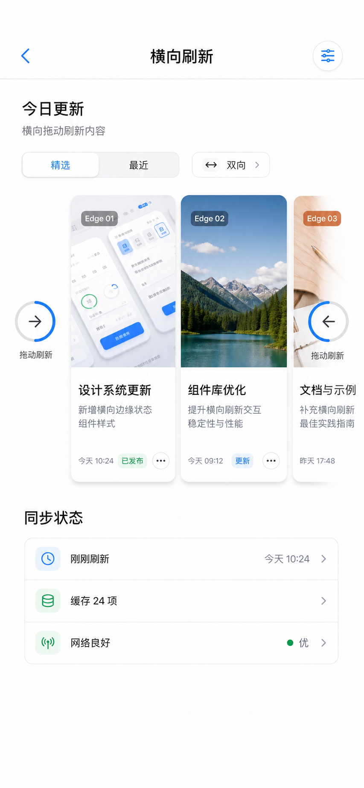

# Horizontal Refresh Production UI Design

Date: 2026-07-01
Status: Approved for implementation

## Goal

Upgrade the horizontal edge refresh experience from a demo-style carousel into a production-quality UIKit screen, while locking the refresh control itself to a compact, system-inspired design.

The refresh control should work for both horizontal edges:

- Leading/left physical edge: arrow points right.
- Trailing/right physical edge: arrow points left.
- Idle and pulling copy is `拖动刷新`.
- Triggered, refreshing, ending, and no-more-data copy changes by state.
- Direction is communicated by the arrow, not by left/right wording in the copy.

Reference design:



## Product Fit

The implementation should remain compatible with the existing `RefreshableStyle` model and the current one-line API:

```swift
collectionView.refreshable(edge: .leading) { ... }
collectionView.loadMoreable(edge: .trailing) { ... }
```

The first implementation should improve:

- `DefaultEdgeStyle` for horizontal edges.
- `HorizontalEdgeDemoController` production UI.

It should not change the public `UIScrollView.refreshable(...)` or `loadMoreable(...)` APIs.

## Refresh Control Visual Design

The confirmed horizontal edge control is intentionally simple:

1. **Transparent host view**
   - No rounded rectangle.
   - No material panel.
   - No border or shadow.
   - The control sits directly on `systemBackground`.

2. **Circular progress**
   - Diameter: 46-52 pt inside a 54 pt default extent.
   - Track: complete light gray circular stroke.
   - Progress: blue circular stroke with round caps.
   - Pulling progress maps to stroke end from `0...1`.
   - Triggered/refreshing states show a complete or nearly complete progress ring.

3. **Directional arrow**
   - Uses system symbol style.
   - Centered inside the progress ring.
   - Physical left edge points right.
   - Physical right edge points left.
   - Vertical edges may keep existing default top/bottom behavior.

4. **Label**
   - Text: `拖动刷新` for horizontal refresh and load-more idle/pulling states.
   - Font: system 12-13 pt.
   - Color: `secondaryLabel`.
   - Single line with minimum scale support.
   - Triggered/refreshing/ending copy updates by state.
   - Refresh role copy: `释放刷新`, `正在刷新...`, `刷新完成`.
   - Load-more role copy: `释放加载`, `正在加载...`, `加载完成`, `没有更多数据`.
   - Directional words such as `左滑` and `右滑` are not used in the label.

5. **No spinner**
   - Do not show `UIActivityIndicatorView`.
   - Refreshing is communicated through circular progress and subtle animation.

## Animation And Interaction Details

### Idle

- Control alpha is managed by the component layer and remains hidden at rest.
- Ring stroke end is `0`.
- Arrow remains centered, pointing toward the scroll content.
- Label shows `拖动刷新`.

### Pulling

- Pull progress `p` is clamped to `0...1`.
- Progress ring stroke end maps to `p`.
- Arrow may translate 0-3 pt toward the content edge as `p` approaches 1.
- Ring and arrow scale may ease from `0.96` to `1.0`.
- Label remains `拖动刷新`.

### Triggered

- Ring stroke end is `1`.
- Arrow scale briefly increases to about `1.06`.
- Label changes to release copy:
  - Refresh role: `释放刷新`.
  - Load-more role: `释放加载`.

### Refreshing

- No spinner appears.
- Ring stroke end remains full.
- Ring may rotate slowly if Reduce Motion is off.
- If Reduce Motion is on, use a subtle alpha pulse instead of rotation.
- Label changes to:
  - Refresh role: `正在刷新...`.
  - Load-more role: `正在加载...`.

### Ending

- Ring rotation stops.
- Ring stroke fades down with the component alpha.
- Label changes to completion copy:
  - Refresh role: `刷新完成`.
  - Load-more role: `加载完成`.

### No More Data

- Applies only to load-more role.
- Ring stroke is low-emphasis gray.
- Arrow is hidden or dimmed.
- Label text is `没有更多数据`.

## Accessibility

- The style view should be one accessibility element.
- Accessibility label should describe the role:
  - Refresh role: `刷新`.
  - Load-more role: `加载更多`.
- Accessibility value should map to state:
  - idle/pulling: `拖动刷新`.
  - triggered: `释放刷新` or `释放加载`.
  - refreshing: `正在刷新` or `正在加载`.
  - ending: `刷新完成` or `加载完成`.
  - noMoreData: `没有更多数据`.
- Respect Reduce Motion by disabling continuous ring rotation.
- Respect dynamic layout direction through physical edge resolution.

## Production Page UI

The horizontal refresh demo should become a realistic product screen.

### Navigation

- Title: `横向刷新`.
- Leading back affordance stays native.
- Trailing action is an icon-only filter/settings action.
- Do not show `LTR` or `RTL` text in the navigation bar.

### Header

- Main title: `今日更新`.
- Supporting text: `横向拖动刷新内容`.
- Include a compact segmented control for `精选` and `最近`.
- Optional small chip: `双向`.

### Horizontal Content Shelf

Cards should look like production content, not colored placeholders:

- Thumbnail/cover area.
- Title.
- Two-line summary.
- Metadata row.
- Status chip.
- Compact action icon.
- About 2.2 cards visible on iPhone width.

### Status Section

Below the horizontal shelf, show a quiet status group:

- `同步状态`.
- `刚刚刷新`.
- `缓存 24 项`.
- `网络良好`.

## Implementation Boundaries

In scope:

- Add deterministic render state helpers for `DefaultEdgeStyle`.
- Replace horizontal edge style spinner layout with circular progress layout.
- Keep vertical default edge behavior stable unless needed for shared code.
- Redesign `HorizontalEdgeDemoController` page and cells.
- Add tests for render state, arrow direction, labels, and no-spinner behavior.
- Save the reference design image in docs.

Out of scope:

- Changing public API.
- Adding third-party dependencies.
- Replacing top/bottom default header/footer styles.
- Building an asset pipeline for generated imagery.
- Adding a new renderer or snapshot testing dependency.

## Acceptance Criteria

- Design doc exists and references the copied design image.
- Implementation plan exists under `docs/superpowers/plans/`.
- Horizontal edge control uses a circular progress ring and directional arrow.
- Horizontal edge control does not contain `UIActivityIndicatorView`.
- Horizontal edge label is `拖动刷新` for both leading and trailing idle/pulling states.
- Physical left edge arrow points right; physical right edge arrow points left.
- Navigation bar no longer shows `LTR` or `RTL`.
- Demo page uses production-style cards and a status section.
- Behavior tests cover the horizontal state copy, circular progress, spinner removal, and physical arrow mapping.
- Current executable verification passes with the iOS Simulator Demo build.
