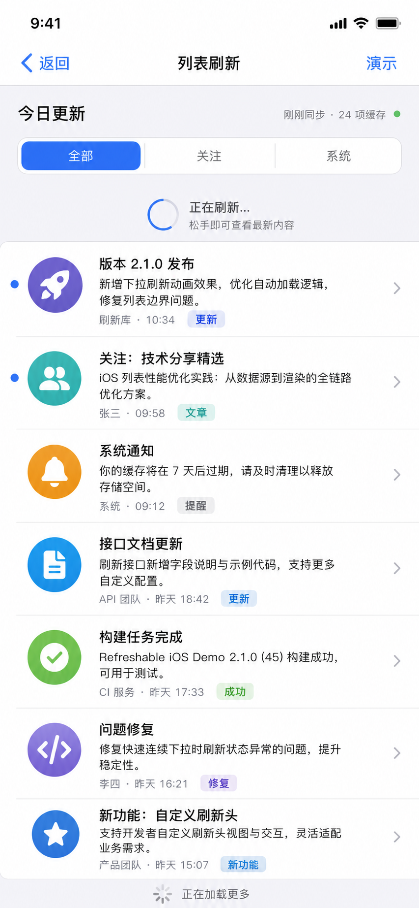

# List Refresh Production UI DSL

Date: 2026-07-06
Status: Selected visual target for implementation
Selected visual: the second-to-last generated image, saved as `assets/list-refresh-selected-update-list.png`

## Goal

Turn the existing `TableViewDemoController` into a production-quality vertical list demo that clearly demonstrates:

- Pull down to refresh.
- Automatic load more when scrolling near the bottom.
- Resetting the load-more terminal state after refresh.
- A realistic, readable UIKit list rather than placeholder rows.

The page should feel like a compact update center for a real product, while staying native to iOS and compatible with the current Refreshable API.

## Effect Images



## Product Surface

```refresh-ui-dsl
screen ListRefreshDemo {
  platform: iOS UIKit
  viewport: 390x844
  controller: Demo/Demo/TableViewDemoController.swift
  title: "列表刷新"
  purpose: "Demonstrate top refresh and bottom automatic load-more in a realistic table view."

  refreshBehavior {
    top {
      gesture: pullDown
      style: SystemNativeRefreshStyle
      visibleCopy {
        idle: "下拉刷新"
        pulling: "下拉刷新"
        triggered: "释放刷新"
        refreshing: "正在刷新..."
        ending: "刷新完成"
      }
      subtitleWhenRefreshing: "松手即可查看最新内容"
      actionLatency: 0.9s
      result: "Insert a fresh update row at the top, reset page to 0, reset noMoreData."
    }

    bottom {
      gesture: scrollNearBottom
      style: DefaultBottomLoadMoreStyle
      automaticTriggerOffset: 120
      visibleCopy {
        idle: "上拉加载更多"
        pulling: "上拉加载更多"
        triggered: "释放加载"
        refreshing: "正在加载..."
        ending: "加载完成"
        noMoreData: "没有更多数据"
      }
      actionLatency: 0.7s
      result: "Append the next page until page 3, then show noMoreData."
    }
  }
}
```

## Visual Tokens

```refresh-ui-dsl
tokens {
  colors {
    pageBackground: UIColor.systemGroupedBackground
    groupedSurface: UIColor.secondarySystemGroupedBackground
    primaryText: UIColor.label
    secondaryText: UIColor.secondaryLabel
    tertiaryText: UIColor.tertiaryLabel
    separator: UIColor.separator.withAlpha(0.45)
    accent: UIColor.systemBlue
    accentSecondary: UIColor.systemTeal
    success: UIColor.systemGreen
    warning: UIColor.systemOrange
    danger: UIColor.systemRed
    purple: UIColor.systemPurple
  }

  typography {
    navTitle: system 17 semibold
    headerTitle: system 28 bold
    status: system 15 regular
    segment: system 16 semibold
    rowTitle: system 20 bold
    rowSummary: system 16 regular, lineHeight 22, maxLines 2
    rowMeta: system 14 regular
    chip: system 13 semibold
    footer: system 15 regular
  }

  spacing {
    screenHorizontal: 18
    headerTop: 28
    headerBottom: 22
    segmentHeight: 38
    refreshBandHeight: 82
    listHorizontalInset: 0
    rowHorizontal: 18
    rowVertical: 16
    avatarSize: 72
    avatarToText: 18
    chevronWidth: 22
    chipHorizontal: 10
    chipVertical: 3
    footerHeight: 52
  }

  radius {
    segmentOuter: 8
    segmentSelected: 8
    listGroup: 8
    avatar: 36
    chip: 6
  }
}
```

## Layout DSL

```refresh-ui-dsl
navigationBar {
  background: systemBackground
  leading: nativeBackButton("返回")
  title: text("列表刷新", token.navTitle)
  trailing: textButton("演示", tint: accent)
}

tableHeader {
  background: pageBackground
  layout: verticalStack(spacing: 18)
  safeAreaAware: true

  headerRow {
    leading: text("今日更新", token.headerTitle)
    trailing: inlineStatus {
      text("刚刚同步 · 24 项缓存", token.status, color: secondaryText)
      dot(size: 8, color: success)
    }
  }

  segmentedControl {
    items: ["全部", "关注", "系统"]
    selectedIndex: 0
    height: token.segmentHeight
    selectedTint: accent
    selectedTextColor: white
    normalTextColor: secondaryText
    background: secondarySystemGroupedBackground
    border: separator 1px
  }
}

refreshControlRevealedArea {
  owner: Refreshable
  visibleWhen: pulling | triggered | refreshing | ending
  placement: "revealed by the scroll view at the top edge"
  height: token.refreshBandHeight
  content: horizontalStack(spacing: 14, alignment: center) {
    circularProgress(size: 42, strokeWidth: 4, progress: state.progress, color: accent)
    verticalStack(spacing: 4) {
      text(state.primaryCopy, system 18 semibold, color: primaryText)
      text("松手即可查看最新内容", system 15 regular, color: secondaryText)
    }
  }
}

listGroup {
  background: groupedSurface
  cornerRadius: token.radius.listGroup
  separator: separator
  rows: updateRows
}

loadMoreFooter {
  height: token.footerHeight
  background: pageBackground
  content: horizontalStack(spacing: 10, alignment: center) {
    spinner(style: medium, color: tertiaryText)
    text("正在加载更多", token.footer, color: secondaryText)
  }
}
```

## Row DSL

```refresh-ui-dsl
component UpdateRow {
  height: automatic(min: 112)
  background: groupedSurface
  selection: none
  accessibility: combineChildren

  leadingIndicator {
    position: x 14, centerY avatar.centerY
    size: 8
    color: row.unread ? accent : clear
  }

  avatar {
    size: token.avatarSize
    cornerRadius: token.radius.avatar
    background: row.tint.withAlpha(0.18)
    symbol: row.symbol
    symbolColor: row.tint
    symbolPointSize: 34
  }

  content {
    title: row.title, token.rowTitle
    summary: row.summary, token.rowSummary
    metaLine {
      text(row.source + " · " + row.time, token.rowMeta, color: secondaryText)
      chip(row.chip, style: row.chipStyle)
    }
  }

  trailing {
    symbol: "chevron.right"
    color: tertiaryText
    pointSize: 20
  }
}
```

## Data DSL

```refresh-ui-dsl
updateRows = [
  {
    title: "版本 2.1.0 发布"
    summary: "新增下拉刷新动画效果，优化自动加载逻辑，修复列表边界问题。"
    source: "刷新库"
    time: "10:34"
    chip: "更新"
    chipStyle: blue
    symbol: "paperplane.fill"
    tint: systemPurple
    unread: true
  },
  {
    title: "关注：技术分享精选"
    summary: "iOS 列表性能优化实践：从数据源到渲染的全链路优化方案。"
    source: "张三"
    time: "09:58"
    chip: "文章"
    chipStyle: teal
    symbol: "person.2.fill"
    tint: systemTeal
    unread: true
  },
  {
    title: "系统通知"
    summary: "你的缓存将在 7 天后过期，请及时清理以释放存储空间。"
    source: "系统"
    time: "09:12"
    chip: "提醒"
    chipStyle: gray
    symbol: "bell.fill"
    tint: systemOrange
    unread: false
  },
  {
    title: "接口文档更新"
    summary: "刷新接口新增字段说明与示例代码，支持更多自定义配置。"
    source: "API 团队"
    time: "昨天 18:42"
    chip: "更新"
    chipStyle: blue
    symbol: "doc.text.fill"
    tint: systemBlue
    unread: false
  },
  {
    title: "构建任务完成"
    summary: "Refreshable iOS Demo 2.1.0 (45) 构建成功，可用于测试。"
    source: "CI 服务"
    time: "昨天 17:33"
    chip: "成功"
    chipStyle: green
    symbol: "checkmark.circle.fill"
    tint: systemGreen
    unread: false
  },
  {
    title: "问题修复"
    summary: "修复快速连续下拉时刷新状态异常的问题，提升稳定性。"
    source: "李四"
    time: "昨天 16:21"
    chip: "修复"
    chipStyle: purple
    symbol: "chevron.left.forwardslash.chevron.right"
    tint: systemPurple
    unread: false
  },
  {
    title: "新功能：自定义刷新头"
    summary: "支持开发者自定义刷新头视图与交互，灵活适配业务需求。"
    source: "产品团队"
    time: "昨天 15:07"
    chip: "新功能"
    chipStyle: blue
    symbol: "star.fill"
    tint: systemBlue
    unread: false
  }
]
```

## Interaction States

### Initial

- Shows the selected `全部` segment.
- Header status reads `刚刚同步 · 24 项缓存`.
- List has 7 production rows.
- The refresh revealed area is hidden because the top component is idle.
- Bottom load-more is idle and hidden until the table nears the bottom.

### Pulling

- Refreshable controls alpha and reveal behavior.
- Top refresh text uses `下拉刷新` before threshold and `释放刷新` at threshold.
- The page content should not jump; keep default `.contentInset` presentation.

### Refreshing

- Top refresh control shows `正在刷新...` and the subtitle `松手即可查看最新内容`.
- A new row appears at index 0 after the async action completes:
  - Title: `刚刚刷新完成`
  - Summary: `已同步最新更新流，并重置底部自动加载状态。`
  - Chip: `刚刚`
- Header status updates to `刚刚同步 · 24 项缓存`.
- `resetNoMoreData()` is called.

### Automatic Load More

- `loadMoreable` uses `RefreshableOptions(automaticTriggerOffset: 120)`.
- When the scroll view is within 120 pt of the bottom, the bottom component enters refreshing without requiring an overscroll gesture.
- Appended rows use the same `UpdateRow` component and realistic content.

### No More Data

- After page 3, call `tableView.noMoreData()`.
- Footer copy becomes `没有更多数据`.
- A following pull-to-refresh calls `tableView.resetNoMoreData()`.

## Accessibility

- Navigation title remains readable by VoiceOver as `列表刷新`.
- Segmented control exposes `全部`, `关注`, and `系统` as selectable filters.
- Each row should expose one combined label:
  - `{title}，{summary}，{source}，{time}，{chip}`
- Refresh control accessibility:
  - Label: `刷新`
  - Values: `下拉中`, `释放刷新`, `正在刷新`, `刷新完成`
- Load-more accessibility:
  - Label: `加载更多`
  - Values: `正在加载`, `加载完成`, `没有更多数据`

## Implementation Boundaries

In scope:

- Redesign `TableViewDemoController` only.
- Add a private data model and private custom table cell in the same file unless the file becomes unwieldy during implementation.
- Use existing Refreshable APIs and built-in UIKit/SF Symbols.
- Use `SystemNativeRefreshStyle` for top refresh and `DefaultBottomLoadMoreStyle` for bottom load more.
- Use `automaticTriggerOffset` for bottom automatic loading.
- Add UI tests for the visible screen and main refresh/load-more behavior.

Out of scope:

- Changing public Refreshable APIs.
- Adding third-party dependencies.
- Adding real network or persistence.
- Building new tabs or routes.
- Replacing global default refresh styles.

## Acceptance Criteria

- The selected effect image appears in this document.
- All generated effect images are archived under `docs/superpowers/specs/assets/`.
- `TableViewDemoController` no longer displays placeholder `Item N` rows.
- The first tab presents a production-quality update list matching the selected target direction.
- The page includes a header, status line, segmented control, realistic update rows, and bottom load-more state.
- Pulling down refreshes and inserts a new top row.
- Scrolling near the bottom automatically loads more rows via `automaticTriggerOffset`.
- After the final page, the bottom component enters no-more-data.
- Pulling down again resets the no-more-data state.
- Demo UI tests cover key labels and at least one refresh path.
